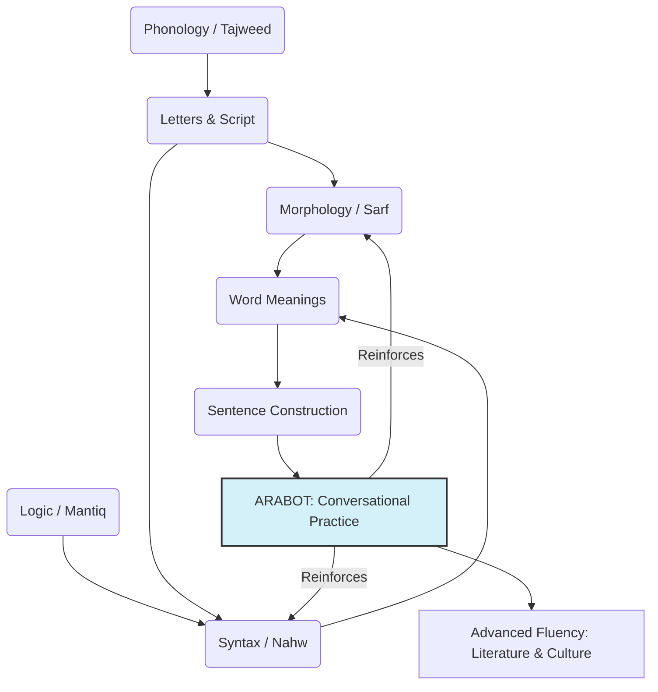

# Assignment 1: Project Proposal - ARABOT

## Group Members and Expertise

*   **Maira Aijaz** (Language & Content Lead): Arabic vocabulary, word meanings, and sentence patterns.
*   **Muhammad Asad Piracha** (Learning Design): Dependency analysis and curriculum progression.
*   **Qadrain Qadri Khan** (AI Tools): LLM interaction, feedback, and scoring systems.

## 1. Brief Statement of the Problem
Students of Arabic often face a "bottleneck" where they master prescriptive grammar rules (Morphology and Syntax) in theory but struggle to apply them in conversation. The abstract nature of grammar leads to a high cognitive load, causing demotivation. There is a need for a tool that makes learning fun and low-pressure.

## 2. Introduction (Motivation \& Project Goal)
Our project, **ARABOT**, is an intelligent, conversational practice partner. It facilitates real-life Arabic conversations tailored to the student’s level, making language acquisition an engaging and supportive experience.

**Core Features:**
*   **Conversational Immersion:** 5-10 minute practice on random "real-life" topics.
*   **Contextual Support:** Ask the AI about unfamiliar words mid-chat.
*   **Performance Feedback:** A fun scoring system to track improvement and stay motivated.

## 3. The ARABOT Methodology: How it Teaches
1.  **Fun Scenarios:** Choose from scenarios like shopping, traveling, or hobbies.
2.  **Instant Help:** Get word roots and morphological explanations instantly.
3.  **Low-Stress Correction:** Feedback is provided after the chat, keeping the conversation flow natural.
4.  **Gamified Learning:** Earn scores and track your journey toward fluency.

## 4. Subject Dependency Graph
The following graph shows the progression from basic script to advanced literature and culture.

## 5. Motivation Summary
**ARABOT** bridges the gap between rote memorization and natural conversation, making the path to Arabic mastery simple, fun, and accessible for everyone.
